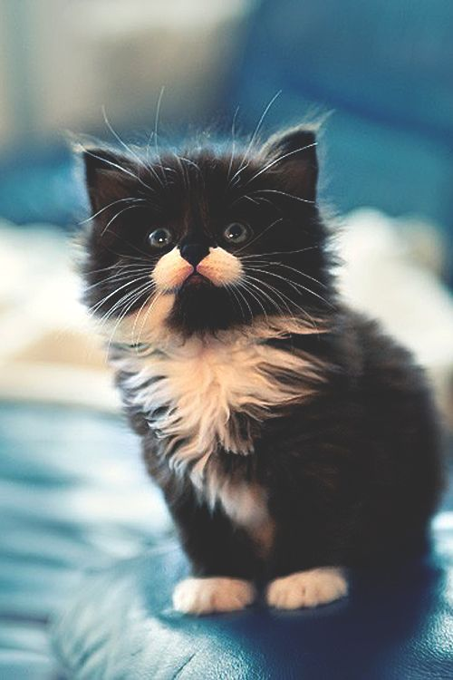
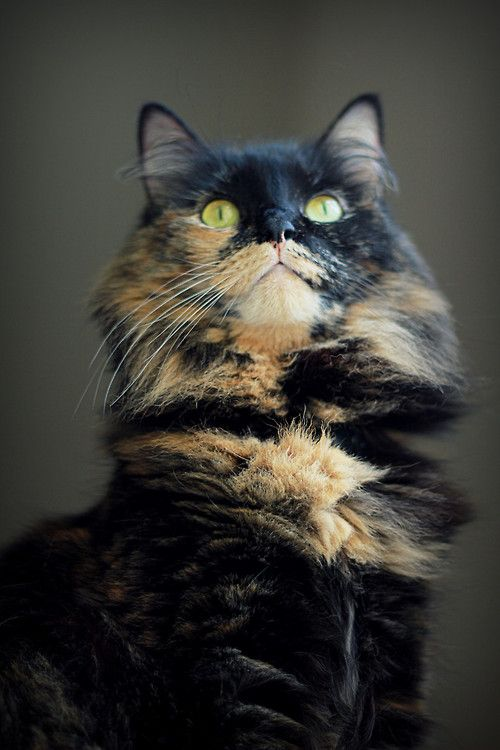

[效果图](https://wudimingwo.github.io/julitiaozhengdaxiao/)


```
    
<html>
    <head>
        <meta charset="UTF-8"/>
        <title>practice</title>
        <style type="text/css">
        	.wrapper {
        		width: 800px;
        		height: 300px;
        		margin: 300px auto;
        	}
        	.wrapper a {
        		text-decoration: none;
        	}
        	.wrapper a img{
        		width: 100px;
        		height: 100px;
        		border-radius: 50%;
        	}
        	
        </style>
    </head>
    <body>
        <div class="wrapper">
	        <a href="javascript:void(0);">
	        	
	        </a>
	        <a href="javascript:void(0);">
	        	
	        </a>
	        <a href="javascript:void(0);">
	        	
	        </a>
	        <a href="javascript:void(0);">
	        	
	        </a>
	        <a href="javascript:void(0);">
	        	
	        </a>
	        <a href="javascript:void(0);">
	        	
	        </a>
        	
        </div>
        <script src="jqmin.js" type="text/javascript" charset="utf-8"></script>
        <script type="text/javascript">
            
            
            $('body').on('mousemove',function (e) {
            	$("img").each(function (index) {
            		var dis = getDis(this,e);
            		changeSize(dis,this,200,200);
            	})
            })
            // 根据距离, 调整大小
            
            function changeSize (dis,item,targetX,targetY) {
            	var item = $(item);
            	var w = item.width();
            	var h = item.height();
            	// 这里简单回顾了一下惰性函数. 主要是希望, 这个w,h值能够被初始化.
            	changeSize = function (dis,item,targetX,targetY) {
            		
	            	var disx = Math.min(dis,targetX);
	            	var disy = Math.min(dis,targetY);
	            	var item = $(item);

	            	
	            	// 基本效果是, 距离越远, 大小越小. 两者反比.
	            	// 当两者距离为0 时, 为最大值, 
                        // 这一段不太好想.
	            	
	            	var sizeX = (targetX - disx) / targetX * w + w;
	            	var sizeY = (targetY - disy) / targetY * h + h;
	            	item.css({
	            		'width' : sizeX + 'px',
	            		'height' : sizeY + 'px'
	            	})
            	}
            	changeSize();
            }
            
            
            // 求出鼠标位置和 元素中心位置的距离
            function getDis (item,e) {
            	// 元素默认宽高
            	var item = $(item);
            	var w = item.width();
            	var h = item.height();
            	
            	getDis = function (item,e) {
            		var item = $(item);
            		//中心左顶点相对于文档坐标
            		var l = item.offset().left;
            		var t = item.offset().top;
            		// 元素中心点坐标
            		var ox = l + w/2;
            		var oy = t + h/2;
            		// 鼠标坐标
            		var x = e.clientX;
            		var y = e.clientY;
            		// 应用勾股定理, 求出距离
            		var dis = parseInt(Math.sqrt(Math.pow(Math.abs(ox - x),2) + Math.pow(Math.abs(ox - x),2)));
            		return dis
            	}
            	return getDis(item,e);
            }
            
            
        </script>
    </body>
</html>
```

这里有必要去回顾一下, 因为就我本人而言, 这里之前还挺不清楚的


我们希望的是, dis 越大, w 越小,
dis越小, w 越大.
但 w的最小值为 w, 最大值为target
dis的最小值是0  dis的最大值是无限?
要怎么表示这种反比关系?
假设动态的 w 值设为size
我第一个想到的是, 与动态的dis 成反比, 即
size = x / dis
这样就能做到 dis 越大 size 越小, x 为一个待定的某个数
如果dis 的取值范围是 0 ~ 无限,
那么size 的取值范围也是 0 ~ 无限
加上 w 就能确保 size 的 最小值是 w , 即
size = x/dis + w
怎么加上最大值的限定?
我们看一下小松老师的公式
dis = Math.min(dis,target) / 限定了dis 的取值范围
size = (target - dis)/target * w + w
我们发现一个事实, 
dis == target时, size 有最小值, 为 w
dis == 0 时, size 有最大值, 为 2w
我们惊讶的发现(至少我是惊讶的)
尼玛, 原来这个公式能够完成 所谓的反比, 但实际上 最大值并不是我们期望的 target

我深感自己的数学似乎都还给老师了, 又或者, 不太习惯用代码的方式去思考数学关系?

不过根据小松老师的方案, 我们起码得到了一个很重要的思路, 即
我思考反比的时候, 考虑的是 
size = 1/dis
而实际上可以用正比的方式考虑,即
size = (target - dis)/target * some  这样也能实现一个反比.
size 和 (target - dis) 是成正比的, 
(target - dis) 和 dis 是成反比的, 当然不能算是严格意义上的反比, 但也是此消彼长的关系.
1/dis 这种数值变化是 指数型的,  而 (target - dis)/target * some 这种数值变化是 线性的.


-----------------------
--------------------
### 所以最终常用的反比应该是这个
```
            	var size = (target - dis) / target * (targetWidth - w) + w;
```
target的作用是, 进入这个距离之后, 才会开始有所变化.
 (target - dis) / target 的作用是 和 size 进行反比例的变化. 此消彼长的变化
targetWidth 是我们期望的最大值, 故 (targetWidth - w) 保证了最大值为 (targetWidth - w)
w 保证了 最小值为 w
 所以size 的取值范围是 [w, targetWidth] , 而起这个作用的dis范围是[0,target]

尽管在这里我们消耗的时间稍微有点长, 
但鉴于可能以后经常遇到这种反比关系的情形, 还是有必要好好加深一下印象的.

所以我们把上面的changeSize 函数稍微改一下
```
            function changeSize (dis,item,targetX,targetY,effectDis) {
                var item = $(item);
                var w = item.width();
                var h = item.height();
                var effectDis = effectDis || 500;
                // 这里简单回顾了一下惰性函数. 主要是希望, 这个w,h值能够被初始化.
                changeSize = function (dis,item,targetX,targetY) {
                    
                    var disx = Math.min(dis,effectDis);
                    var disy = Math.min(dis,effectDis);
                    var item = $(item);
					
                    
                    // 基本效果是, 距离越远, 大小越小. 两者反比.
                    // 当两者距离为0 时, 为最大值, 
                        // 这一段不太好想.
                    
                    var sizeX = (effectDis - disx) / effectDis * (targetX - w) + w;
                    var sizeY = (effectDis - disy) / effectDis * (targetY - h) + h;
                    item.css({
                        'width' : sizeX + 'px',
                        'height' : sizeY + 'px'
                    })
                }
                changeSize();
            }
```


